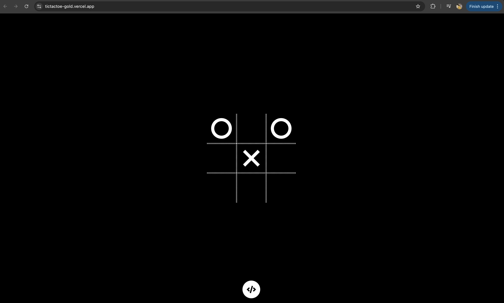
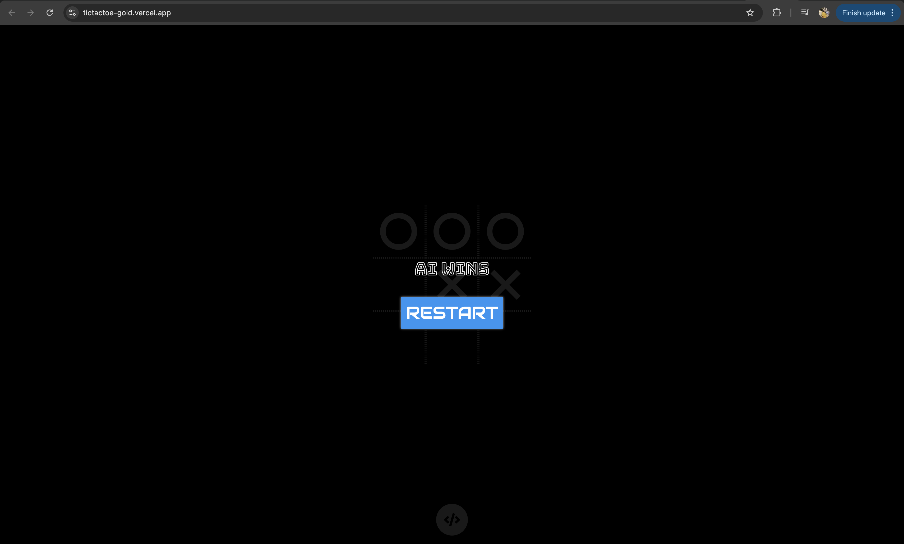

# Unbeatable Tic Tac Toe

## Overview

This project is an implementation of the classic Tic Tac Toe game using React and the Minimax algorithm. The game is designed to be unbeatable, meaning that the AI will always either win or draw. The primary objective of this project is to demonstrate the use of the Minimax algorithm in a real-world application and to create a responsive, interactive user interface with React.

## Features

- **Unbeatable AI**: Implements the Minimax algorithm to ensure the AI never loses.
- **Interactive UI**: Built with React for a smooth and responsive user experience.
- **Human vs. AI**: Play against the AI that always makes the best possible move.

## Technologies Used

- **React**: Frontend library for building the user interface.
- **Minimax Algorithm**: Decision-making algorithm for implementing the AI.
- **JavaScript**: Main programming language for the logic.
- **CSS**: For styling the application.

## Getting Started

### Prerequisites

- **Node.js** (v12 or later) and **npm**: Ensure you have Node.js and npm installed on your machine.

## How It Works
###Minimax Algorithm
The Minimax algorithm is a recursive decision-making algorithm used to determine the optimal move for the AI player. It evaluates all possible moves and assigns a score to each move based on the likelihood of winning, drawing, or losing. The AI then selects the move with the highest score, ensuring that it either wins or forces a draw.

### React Implementation
- **Game Component**: Manages the state of the game, including the board, player turns, and the winner.
- **Board Component**: Renders the Tic Tac Toe grid and handles user interactions.
- **Cell Component**: Represents each cell in the grid.
### AI Strategy
- The AI always plays as 'O'.
- The Minimax algorithm is used to evaluate each possible move and select the best one.
- The algorithm ensures that the AI will either win or draw, making it unbeatable.

## Screenshots

